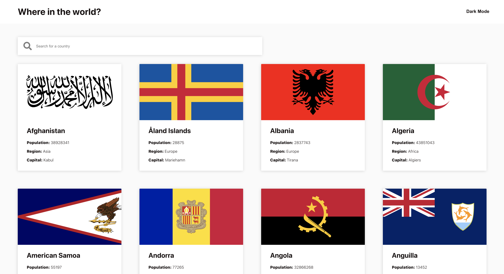

# Frontend Mentor - REST Countries API with color theme switcher solution

This is a solution to the [REST Countries API with color theme switcher challenge on Frontend Mentor](https://www.frontendmentor.io/challenges/rest-countries-api-with-color-theme-switcher-5cacc469fec04111f7b848ca).

## Table of contents

- [Overview](#overview)
  - [The challenge](#the-challenge)
  - [Future improvements](#future-improvements)
  - [Screenshot](#screenshot)
  - [Links](#links)
- [My process](#my-process)
  - [Built with](#built-with)
  - [What I learned](#what-i-learned)
- [Author](#author)

## Overview

### The challenge

Users should be able to:

- See all countries from the API on the homepage
- Search for a country using an `input` field
- Filter countries by region (TODO:)
- Click on a country to see more detailed information on a separate page
- Click through to the border countries on the detail page (TODO:)
- Toggle the color scheme between light and dark mode

### Future improvements

- Better responsivity
- Filtering
- Better loading state
- Lazy loading (right now the front page loads all the countries for no reason)

### Screenshot

### Links

- Live Site URL: [https://fem-rest-countries.netlify.app/](https://fem-rest-countries.netlify.app)

## My process

### Built with

- React & Typescript
- CSS custom properties
- Flexbox & CSS Grid

### What I learned

- CSS custom properties
- CSS Grid

## Author

- Frontend Mentor - [@emmi](https://www.frontendmentor.io/profile/emmi)
- Twitter - [@EmmiSiitonen](https://www.twitter.com/EmmiSiitonen)
